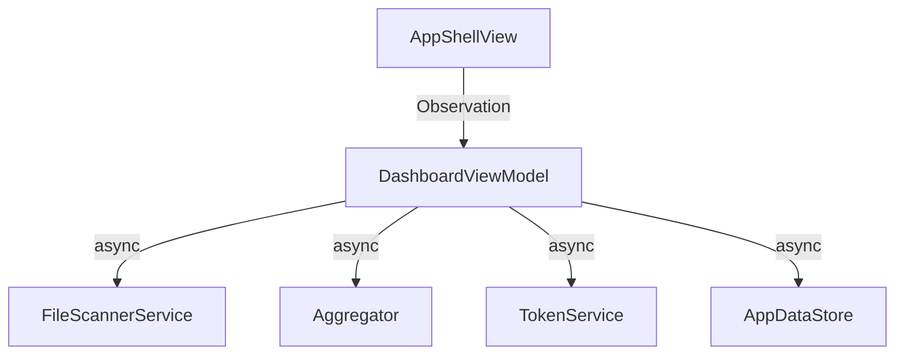

# Architecture Overview

This document describes the planned modular layout for CodeCopier based on the refactor roadmap. The project follows a service-oriented approach with Swift actors used for concurrency.

## Modules
- **CodeCopierCore** – houses the data models and core business logic.
- **CodeCopierCLI** – command line interface target that depends on `CodeCopierCore`.
- **CodeCopierUI** – SwiftUI-based macOS application target.

## Concurrency Model
Services such as `FileScannerService`, `Aggregator`, and `TokenService` are implemented as actors. `AppDataStore` is a single actor responsible for persistence. The UI communicates with these services via async calls to ensure tasks never block the main thread.

## Data Flow

Each service publishes progress updates through `Observable` properties which the `DashboardViewModel` observes.
